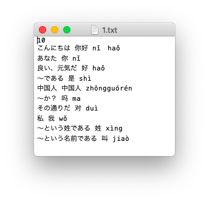
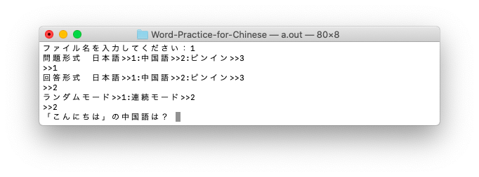
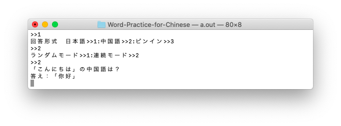
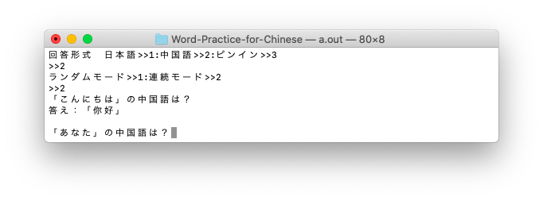

# Word-Practice-for-Chinese


Word-Practice-for-Chineseは中国語の単語の学習をコンソール上で行えるアプリケーションです。


使用言語：C言語

本アプリケーションはC言語で書かれているので、MAC OSの場合、通常のやり方でコンパイルしていただき、生成された実行ファイルを実行させてください。

例：MacOSの場合
```
gcc wordpractice.c
./a.out
```

アプリケーションに使用するテキストファイル、ソースコードはUTF-8で書かれているのでMAC OSでの動作を推奨します。
もし、Windowsで使用する場合は、全テキストファイルをShift-Jis(ANSI)に変換していただき、コンパイルと実行は以下のようにお願いします。

例：Windowsの場合
```
gcc wordpractice.c -finput-charset=UTF-8 -fexec-charset=CP932
a.exe
```

# データファイルの準備
学習を行うためには、本アプリケーションに使用するテキストファイルを用意する必要があります。
テキストファイルの構成は以下のようになります。
```
データの数(n)
日本語_中国語_拼音
日本語_中国語_拼音
...(以下同行)
```

具体的には以下のとおりです。



このデータを/dateフォルダに入れると使えるようになります。
 
# 学習の開始

アプリケーションの実行後、以下の４つを選択します。
- ファイル名(拡張子なし)
- 問題形式 (1=日本語 2=中国語 3=拼音)
- 回答形式 (1=日本語 2=中国語 3=拼音)
- 出題形式(1=ランダムモード　2=連続モード)

ファイル名は拡張子、ディレクトリ指定なしです。

出題形式がランダムモードの時、出題される問題はランダムで選ばれ、アプリケーションを終了するときは強制終了(ctrl+c)を行います。

出題形式が連続モードの時、出題される問題はデータファイルの上から順に選ばれ、最後まで出題し終わるとアプリケーションは終了します。

---

仮にファイル名を「1」、問題形式を「1」、回答形式を「2」、出題形式を「2」の時以下のように表示されます。



初めに問題が表示されるので、頭で考える、紙に書くなどして回答してください。

問題が表示されている状態からエンターキーを押下すると回答が表示されます。



回答が表示されている状態でエンターキーを押下すると次の問題が表示されます。



以上を繰り返し学習を進めていきます。
異常を繰り返し学習を進めていきます。
